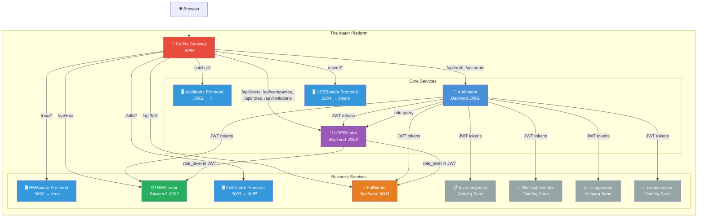

# The Inator Platform

> *"If I had a nickel for every microservice I built with an -inator suffix, I'd have… well, several nickels. Which isn't a lot, but it's weird that it keeps happening."*

The Inator Platform is a family of purpose-built microservices for **business-to-customer information sharing**. Each inator gives **admins** the tools to manage operations and **customers** clear visibility into what matters to them — returns, orders, deliveries, and more.

Every inator is self-contained, independently deployable, and follows the same conventions. Add a new one when you need a new capability. It's microservices, but fun.

## Architecture


```mermaid
graph TB
    CLIENT[🌐 Browser] --> CADDY

    subgraph "The Inator Platform"
        CADDY[🔀 Caddy Gateway<br/><i>:8080</i>]

        subgraph "Core Services"
            AUTH_FE[🖥 Authinator Frontend<br/><i>:3001 → /</i>]
            AUTH[🔐 Authinator<br/><i>Backend :8001</i>]
            USER_FE[🖥 USERinator Frontend<br/><i>:3004 → /users</i>]
            USER[👤 USERinator<br/><i>Backend :8004</i>]
        end

        subgraph "Business Services"
            RMA_FE[🖥 RMAinator Frontend<br/><i>:3002 → /rma</i>]
            RMA[📦 RMAinator<br/><i>Backend :8002</i>]
            FULFIL_FE[🖥 Fulfilinator Frontend<br/><i>:3003 → /fulfil</i>]
            FULFIL[🚚 Fulfilinator<br/><i>Backend :8003</i>]
            INV[📋 Inventoryinator<br/><i>Coming Soon</i>]
            NOTIF[🔔 Notificationinator<br/><i>Coming Soon</i>]
            USAGE[📊 Usageinator<br/><i>Coming Soon</i>]
            LIC[📄 Licenseinator<br/><i>Coming Soon</i>]
        end
    end

    CADDY -->|/api/auth, /accounts| AUTH
    CADDY -->|/api/users, /api/companies, /api/roles, /api/invitations| USER
    CADDY -->|/api/rma| RMA
    CADDY -->|/api/fulfil| FULFIL
    CADDY -->|/rma/*| RMA_FE
    CADDY -->|/fulfil/*| FULFIL_FE
    CADDY -->|/users/*| USER_FE
    CADDY -->|catch-all| AUTH_FE

    AUTH -- JWT tokens --> RMA
    AUTH -- JWT tokens --> FULFIL
    AUTH -- JWT tokens --> USER
    AUTH -- JWT tokens --> INV
    AUTH -- JWT tokens --> NOTIF
    AUTH -- JWT tokens --> USAGE
    AUTH -- JWT tokens --> LIC
    AUTH -- role query --> USER
    USER -- role_level in JWT --> RMA
    USER -- role_level in JWT --> FULFIL

    style CADDY fill:#e74c3c,color:#fff
    style AUTH_FE fill:#3498db,color:#fff
    style USER_FE fill:#3498db,color:#fff
    style RMA_FE fill:#3498db,color:#fff
    style FULFIL_FE fill:#3498db,color:#fff
    style AUTH fill:#4a90d9,color:#fff
    style USER fill:#9b59b6,color:#fff
    style RMA fill:#27ae60,color:#fff
    style FULFIL fill:#e67e22,color:#fff
    style INV fill:#95a5a6,color:#fff,stroke-dasharray: 5 5
    style NOTIF fill:#95a5a6,color:#fff,stroke-dasharray: 5 5
    style USAGE fill:#95a5a6,color:#fff,stroke-dasharray: 5 5
    style LIC fill:#95a5a6,color:#fff,stroke-dasharray: 5 5
```

All traffic flows through a **Caddy reverse proxy** on port 8080. API requests route to backends by path prefix. Each inator serves its own frontend — Caddy routes `/rma/*`, `/fulfil/*`, `/users/*` to their respective dev servers, with Authinator as the catch-all serving the core UI (login, service directory).

**Authinator** is the foundation — every other inator delegates authentication to it via JWT. **USERinator** is the authoritative source for user profiles, companies, and roles — Authinator enriches JWT tokens with `role_level` and `role_name` claims fetched from USERinator at login.

## Anatomy of an Inator

Each inator is **fully self-contained** — both backend and frontend live within the inator's own directory. Shared frontend code (Layout, AuthProvider, etc.) is provided by a shared library at `shared/frontend/`.

```
<Name>inator/
├── backend/          # Django + Django REST Framework
│   ├── config/       # Settings, URLs, WSGI
│   ├── core/         # Auth integration, permissions, shared models
│   └── <app>/        # Domain-specific apps
├── frontend/         # Vite + React + Tailwind (per-inator UI)
│   ├── src/
│   ├── vite.config.ts
│   └── package.json
├── docs/             # External-facing documentation
├── Reference/        # Internal dev materials (gitignored)
├── deft/             # AI agent framework (gitignored)
├── Taskfile.yml      # Task runner
├── .env.example      # Environment template
└── README.md
```

## Current Inators

| Service | Purpose | Backend | Frontend | API Prefix |
|---------|---------|---------|----------|------------|
| **Authinator** | Auth, SSO, MFA, service directory | :8001 | :3001 → `/` | `/api/auth` |
| **USERinator** | User profiles, companies, roles | :8004 | :3004 → `/users` | `/api/users`, `/api/companies`, `/api/roles`, `/api/invitations` |
| **RMAinator** | Return merchandise authorization | :8002 | :3002 → `/rma` | `/api/rma` |
| **Fulfilinator** | Purchase orders, orders, deliveries | :8003 | :3003 → `/fulfil` | `/api/fulfil` |

## Roles

The platform uses a numeric role level system managed by USERinator:

| Role | Level | Access |
|------|-------|--------|
| **ADMIN** | 100 | Full access. Manage data, users, and workflows across all companies. |
| **MANAGER** | 30 | Company-scoped management. View and manage company users and data. |
| **MEMBER** | 10 | Company-scoped. View and interact with their own company's data. |

Custom roles can be created with any level between 1-100. USERinator owns role definitions; Authinator enriches JWT tokens with `role_level` and `role_name` at login. All services use `role_level >= threshold` for permission checks.

## Quick Start

### Prerequisites
- [Task](https://taskfile.dev/) — `brew install go-task`
- [Caddy](https://caddyserver.com/) — `brew install caddy`
- Python 3.11+
- Node.js 18+
- Git (configured for SSH)

### Installation

```bash
# 1. Clone the platform and all inators
git clone git@github.com:losomode/inator.git
cd inator
git clone git@github.com:losomode/AUTHinator.git Authinator
git clone git@github.com:losomode/RMAinator.git RMAinator
git clone git@github.com:losomode/FULFILinator.git Fulfilinator
git clone git@github.com:losomode/USERinator.git Userinator

# 2. Run first-time setup (installs deps, creates .env, migrates, creates admin)
task setup

# 3. Start everything (backends + frontends + gateway)
task start:all
```

Setup will prompt to create a default admin user (`admin` / `admin@example.com` / `admin123`). You can skip this and create one manually later with `cd Authinator && task backend:manage -- createsuperuser`.

The `setup` task automatically:
- Installs all dependencies (Python + Node.js)
- Creates `.env` files from examples
- Runs database migrations
- Prompts for admin user creation
- Registers services with Authinator

**Access the platform:** http://localhost:8080

The gateway routes all traffic through a single URL. Log in with the admin credentials. Other users can register through the UI and will need admin approval.

**Deploying to a custom domain?** See [`docs/DEPLOYMENT.md`](docs/DEPLOYMENT.md) for configuring the platform for external URLs (e.g., `www.inatorapp.com`).

### Troubleshooting

If services fail to start:

```bash
# Check status
task status

# View logs
tail -50 logs/Authinator-backend.log
tail -50 logs/RMAinator-backend.log
tail -50 logs/Fulfilinator-backend.log
tail -50 logs/USERinator-backend.log
tail -50 logs/Authinator-frontend.log
tail -50 logs/RMAinator-frontend.log
tail -50 logs/Fulfilinator-frontend.log
tail -50 logs/USERinator-frontend.log
tail -50 logs/gateway.log

# Common fixes
task stop:all           # Stop everything
task setup              # Re-run setup
task start:all          # Start again
```

### Demo Database

Want to see the platform in action with realistic data? The demo database includes 4 companies, 12 users with full RBAC hierarchy, 6 catalog items, and sample fulfillment/RMA data.

```bash
# 1. Build the demo databases (does NOT touch your active data)
task setup:demodb

# 2. Switch to demo data (backs up your current databases)
task demodb:activate

# 3. Set up OAuth providers (if you have credentials in .env)
task setup:sso

# 4. Restart services to pick up the new DBs
task restart:all
```

**Demo Data Includes:**
- **4 companies**: Acme Corporation, Globex Industries, Initech LLC, Wayne Enterprises
- **12 users**: 2 platform admins, 10 company users (managers and members)
- **6 catalog items**: Security cameras, sensors, locks, alarms, NVR
- **Full RBAC hierarchy**: ADMIN (100), MANAGER (30), MEMBER (10)
- Complete fulfillment pipeline (purchase orders, orders, deliveries)
- RMA workflows in various states
- **OAuth/SSO**: Google and Microsoft login (if credentials configured)

Log in with any demo account:

| Username | Password | Role | Company |
|----------|----------|------|---------|
| `admin` | `admin` | ADMIN | Platform |
| `alice.admin` | `admin` | ADMIN | Platform |
| `bob.manager` | `manager` | MANAGER | Acme Corporation |
| `carol.member` | `member` | MEMBER | Acme Corporation |
| `frank.manager` | `manager` | MANAGER | Globex Industries |
| `henry.manager` | `manager` | MANAGER | Initech LLC |
| `jack.manager` | `manager` | MANAGER | Wayne Enterprises |

**See full demo details:** [`docs/DEMO_DATABASE.md`](docs/DEMO_DATABASE.md)

To switch back to your real data:

```bash
task demodb:deactivate
task restart:all
```

### Backups & Restore

The platform stores state in each inator's SQLite database at `<Inator>/backend/db.sqlite3`. The backup tooling supports two snapshot types:

- **Rotating** snapshots in `backups/system-backup-*/` (pruned to keep **max 28**)
- **Baseline** snapshots in `backups/baseline/system-backup-*/` (never pruned; manual only)

Automatic rotating backups (recommended — midnight & noon):

```bash
0 0,12 * * * /path/to/inator/scripts/backup.sh >> /path/to/inator/logs/backup.log 2>&1
```

Manual baseline snapshot:

```bash
task backup:baseline
```

Restore (interactive; overwrites DBs and restarts services):

```bash
task backup:restore -- system-backup-YYYY-MM-DD_hh-mm-ss
task backup:restore -- baseline/system-backup-YYYY-MM-DD_hh-mm-ss
```

### Platform-Level Tasks

```bash
# Setup (first-time only)
task setup                # Install all inators, create .env files, run migrations
task setup:authinator     # Setup just Authinator
task setup:rmainator      # Setup just RMAinator

# Demo data
task setup:demodb         # Build demo databases with sample data
task demodb:activate      # Swap to demo data (backs up active DBs)
task demodb:deactivate    # Restore original databases

# Backups
# (Rotating backups are typically run via cron calling scripts/backup.sh)
task backup:baseline       # Create a baseline snapshot (never pruned; manual only)
task backup:restore -- <backup-name>  # Restore a rotating backup (interactive)
task backup:restore -- baseline/<backup-name>  # Restore a baseline backup (interactive)

# Start/Stop/Restart
task start:all            # Start all backends + frontends + Caddy gateway
task stop:all             # Stop all services
task restart:all          # Restart all services
task status               # Check which ports are listening
task logs                 # Tail all logs

# Gateway + Frontends
task gateway:start        # Start Caddy reverse proxy (:8080)
task gateway:stop         # Stop Caddy
task frontends:start      # Start all per-inator frontend dev servers
task frontends:stop       # Stop all frontends

# Individual inator control
task start:rmainator      # Start just RMAinator (backend + frontend)
task stop:fulfilinator    # Stop just Fulfilinator
task restart:authinator   # Restart just Authinator
```

### Per-Inator Tasks

Each inator also has its own `Taskfile.yml` for dev workflows:

```bash
cd RMAinator
task install      # Set up backend + frontend
task dev          # Run backend + frontend
task test         # Run all tests
task lint         # Lint everything
```

## Creating a New Inator

So you need a new -inator? Here's the recipe:

1. **Name it** — `<Domain>inator`. Acronyms stay caps (`RMAinator`), words get title case (`Fulfilinator`).
2. **Create the directory** under this root.
3. **Scaffold** — `backend/` with Django + DRF, `frontend/` with Vite + React + Tailwind.
4. **Assign ports** — next backend port (800X) and frontend port (300X). Register the frontend path in `Caddyfile.dev`.
5. **Integrate auth** — point at Authinator for JWT validation. Use `@inator/shared` for AuthProvider, Layout, etc.
6. **Add a `Taskfile.yml`** — copy from an existing inator, update the project name.
7. **Init git**, create the GitHub repo, add to this README and `.gitignore`.

See [INATOR.md](docs/INATOR.md) for the full standards and conventions.

## Tech Stack

| Layer | Technology |
|-------|-----------|
| Gateway | Caddy 2.x (reverse proxy) |
| Backend | Python 3.11+, Django 6.x, Django REST Framework |
| Frontend | TypeScript (strict), React 19, Vite, Tailwind CSS |
| Auth | JWT (simplejwt), Google SSO, WebAuthn/passkeys |
| Testing | pytest + coverage (backend), Vitest (frontend) |
| Task Runner | [Task](https://taskfile.dev/) |
| AI Tooling | [Deft](https://github.com/losomode/deft) (optional) |

## Project Layout

This repo (`inator`) is the **platform hub** — it contains shared frontend code, gateway config, and orchestration. Each inator (backend + frontend) lives in its own repository and is cloned into this workspace.

```
inator/                  ← You are here (platform repo)
├── Authinator/          ← git@github.com:losomode/AUTHinator.git (core: auth + service directory)
├── RMAinator/           ← git@github.com:losomode/RMAinator.git
├── Fulfilinator/        ← git@github.com:losomode/FULFILinator.git
├── Userinator/          ← git@github.com:losomode/USERinator.git
├── shared/frontend/     ← Shared React library (Layout, AuthProvider, etc.)
├── Caddyfile.dev        ← Dev gateway config (routes :8080)
├── Taskfile.yml         ← Platform-level task runner
├── docs/INATOR.md       ← Standards & conventions
└── README.md            ← This file
```

## License

MIT — See individual inator repos for their specific licenses.
