# The Inator Platform

> *"If I had a nickel for every microservice I built with an -inator suffix, I'd have… well, several nickels. Which isn't a lot, but it's weird that it keeps happening."*

The Inator Platform is a family of purpose-built microservices for **business-to-customer information sharing**. Each inator gives **admins** the tools to manage operations and **customers** clear visibility into what matters to them — returns, orders, deliveries, and more.

Every inator is self-contained, independently deployable, and follows the same conventions. Add a new one when you need a new capability. It's microservices, but fun.

## Architecture

```mermaid
graph TB
    CLIENT[🌐 Browser] --> CADDY

    subgraph "The Inator Platform"
        CADDY[🔀 Caddy Gateway<br/><i>:8080</i>]
        FE[🖥 Unified Frontend<br/><i>Vite + React :5173</i>]
        AUTH[🔐 Authinator<br/><i>Backend :8001</i>]

        subgraph "Business Services"
            RMA[📦 RMAinator<br/><i>Backend :8002</i>]
            FULFIL[🚚 Fulfilinator<br/><i>Backend :8003</i>]
            INV[📋 Inventoryinator<br/><i>Coming Soon</i>]
            NOTIF[🔔 Notificationinator<br/><i>Coming Soon</i>]
            USAGE[📊 Usageinator<br/><i>Coming Soon</i>]
            LIC[📄 Licenseinator<br/><i>Coming Soon</i>]
        end
    end

    CADDY -->|/api/auth, /api/users, /accounts| AUTH
    CADDY -->|/api/rma| RMA
    CADDY -->|/api/fulfil| FULFIL
    CADDY -->|everything else| FE

    AUTH -- JWT tokens --> RMA
    AUTH -- JWT tokens --> FULFIL
    AUTH -- JWT tokens --> INV
    AUTH -- JWT tokens --> NOTIF
    AUTH -- JWT tokens --> USAGE
    AUTH -- JWT tokens --> LIC

    style CADDY fill:#e74c3c,color:#fff
    style FE fill:#3498db,color:#fff
    style AUTH fill:#4a90d9,color:#fff
    style RMA fill:#27ae60,color:#fff
    style FULFIL fill:#e67e22,color:#fff
    style INV fill:#95a5a6,color:#fff,stroke-dasharray: 5 5
    style NOTIF fill:#95a5a6,color:#fff,stroke-dasharray: 5 5
    style USAGE fill:#95a5a6,color:#fff,stroke-dasharray: 5 5
    style LIC fill:#95a5a6,color:#fff,stroke-dasharray: 5 5
```



All traffic flows through a **Caddy reverse proxy** on port 8080. API requests are routed to the appropriate backend by path prefix; everything else is served by the **unified frontend** — a single React SPA that consolidates all inator UIs.

**Authinator** is the foundation — every other inator delegates authentication and user management to it via JWT. Services never store credentials; they validate tokens against Authinator's API.

## Anatomy of an Inator

Each inator's **backend** is self-contained and independently deployable. The frontend is consolidated into a single unified SPA under `frontend/` at the platform root.

```
<Name>inator/
├── backend/          # Django + Django REST Framework
│   ├── config/       # Settings, URLs, WSGI
│   ├── core/         # Auth integration, permissions, shared models
│   └── <app>/        # Domain-specific apps
├── docs/             # External-facing documentation
├── Reference/        # Internal dev materials (gitignored)
├── deft/             # AI agent framework (gitignored)
├── Taskfile.yml      # Task runner
├── .env.example      # Environment template
└── README.md
```

## Current Inators

| Service | Purpose | Backend Port | API Prefix | Repo |
|---------|---------|-------------|------------|------|
| **Authinator** | Authentication, users, SSO, MFA | 8001 | `/api/auth`, `/api/users` | [losomode/AUTHinator](https://github.com/losomode/AUTHinator) |
| **RMAinator** | Return merchandise authorization tracking | 8002 | `/api/rma` | [losomode/RMAinator](https://github.com/losomode/RMAinator) |
| **Fulfilinator** | Purchase orders, orders, deliveries | 8003 | `/api/fulfil` | [losomode/FULFILinator](https://github.com/losomode/FULFILinator) |

## Roles

The platform uses two roles across all services:

- **ADMIN** — Full access. Manage data, users, and workflows across all customers.
- **USER** — Customer-scoped. View and interact with their own customer's data.

Authinator owns the role definitions. Every other inator reads the role from the JWT and enforces it locally.

## Quick Start

### Prerequisites
- [Task](https://taskfile.dev/) — `brew install go-task`
- Python 3.11+
- Node.js 18+
- Git (configured for SSH)

### Installation

```bash
# 1. Clone the platform and all inators
git clone git@github.com:losomode/inator.git
cd inator
git clone git@github.com:losomode/AUTHinator.git Authinator
git clone git@github.com:losomode/RMAinator.git RMAinator
git clone git@github.com:losomode/FULFILinator.git Fulfilinator

# 2. Run first-time setup (installs deps, creates .env, migrates, creates admin)
task setup

# 3. Start everything
task start:all
```

Setup will prompt to create a default admin user (`admin` / `admin@example.com` / `admin123`). You can skip this and create one manually later with `cd Authinator && task backend:manage -- createsuperuser`.

**Access the platform:** http://localhost:8080

The gateway routes all traffic through a single URL. Log in with the admin credentials. Other users can register through the UI and will need admin approval.

### Troubleshooting

If services fail to start:

```bash
# Check status
task status

# View logs
tail -50 logs/Authinator-backend.log
tail -50 logs/RMAinator-backend.log
tail -50 logs/Fulfilinator-backend.log
tail -50 logs/frontend.log
tail -50 logs/gateway.log

# Common fixes
task stop:all           # Stop everything
task setup              # Re-run setup
task start:all          # Start again
```

### Demo Database

Want to see the platform in action with realistic data? The demo database includes 3 companies, 6 users, items, purchase orders, orders, deliveries, and RMAs across various states.

```bash
# Build the demo databases (does NOT touch your active data)
task setup:demodb

# Switch to demo data
task demodb:activate

# Restart services to pick up the new DBs
task restart:all
```

Log in as `admin` / `admin123` or any demo user with password `demo123`:

| User | Role | Company |
|------|------|---------|
| `sarah.chen` | Admin | Meridian Security Solutions |
| `james.wilson` | User | Meridian Security Solutions |
| `lisa.patel` | User | Apex Manufacturing |
| `mike.torres` | User | Apex Manufacturing |
| `emma.jackson` | User | Coastal Networks |

To switch back to your real data:

```bash
task demodb:deactivate
task restart:all
```

### Platform-Level Tasks

```bash
# Setup (first-time only)
task setup                # Install all inators, create .env files, run migrations
task setup:authinator     # Setup just Authinator
task setup:rmainator      # Setup just RMAinator

# Demo data
task setup:demodb         # Build demo databases with sample data
task demodb:activate      # Swap to demo data (backs up active DBs)
task demodb:deactivate    # Restore original databases

# Start/Stop/Restart
task start:all            # Start all backends + unified frontend + Caddy gateway
task stop:all             # Stop all services
task restart:all          # Restart all services
task status               # Check which ports are listening
task logs                 # Tail all logs

# Gateway + Frontend
task gateway:start        # Start Caddy reverse proxy (:8080)
task gateway:stop         # Stop Caddy
task frontend:start       # Start unified frontend dev server (:5173)
task frontend:stop        # Stop unified frontend

# Individual inator control
task start:rmainator      # Start just RMAinator (backend only)
task stop:fulfilinator    # Stop just Fulfilinator
task restart:authinator   # Restart just Authinator
```

### Per-Inator Tasks

Each inator also has its own `Taskfile.yml` for dev workflows:

```bash
cd RMAinator
task install      # Set up backend + frontend
task dev          # Run backend + frontend
task test         # Run all tests
task lint         # Lint everything
```

## Creating a New Inator

So you need a new -inator? Here's the recipe:

1. **Name it** — `<Domain>inator`. Acronyms stay caps (`RMAinator`), words get title case (`Fulfilinator`).
2. **Create the directory** under this root.
3. **Scaffold** — `backend/` with Django + DRF, `frontend/` with Vite + React + Tailwind.
4. **Assign ports** — next available backend port (800X). The frontend module goes in the unified SPA.
5. **Integrate auth** — point at Authinator for JWT validation. Copy `core/authentication.py` from an existing inator.
6. **Add a `Taskfile.yml`** — copy from an existing inator, update the project name.
7. **Init git**, create the GitHub repo, add to this README and `.gitignore`.

See [INATOR.md](./INATOR.md) for the full standards and conventions.

## Tech Stack

| Layer | Technology |
|-------|-----------|
| Backend | Python 3.11+, Django 6.x, Django REST Framework |
| Frontend | TypeScript (strict), React, Vite, Tailwind CSS |
| Auth | JWT (simplejwt), Google SSO, WebAuthn/passkeys |
| Testing | pytest + coverage (backend), Vitest (frontend) |
| Task Runner | [Task](https://taskfile.dev/) |
| AI Tooling | [Deft](https://github.com/losomode/deft) (optional) |

## Project Layout

This repo (`inator`) is the **platform hub** — it contains the unified frontend, gateway config, and orchestration. Each inator backend lives in its own repository and is cloned into this workspace.

```
inator/                  ← You are here (platform repo)
├── Authinator/          ← git@github.com:losomode/AUTHinator.git
├── RMAinator/           ← git@github.com:losomode/RMAinator.git
├── Fulfilinator/        ← git@github.com:losomode/FULFILinator.git
├── frontend/            ← Unified React SPA (all inator UIs)
├── Caddyfile.dev        ← Dev gateway config (routes :8080)
├── Taskfile.yml         ← Platform-level task runner
├── INATOR.md            ← Standards & conventions
└── README.md            ← This file
```

## License

MIT — See individual inator repos for their specific licenses.
