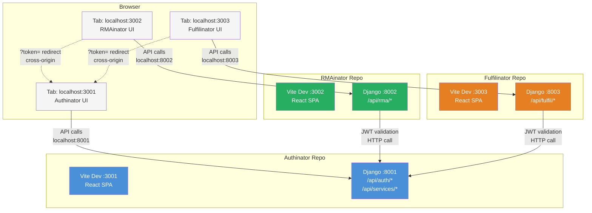
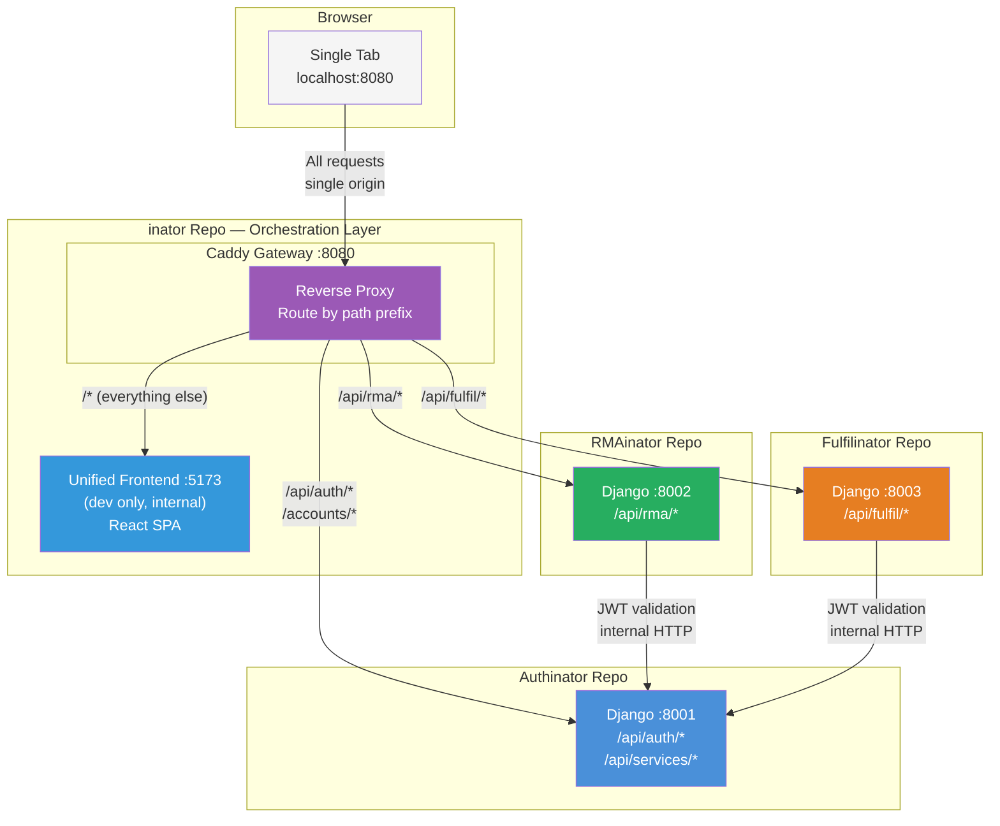
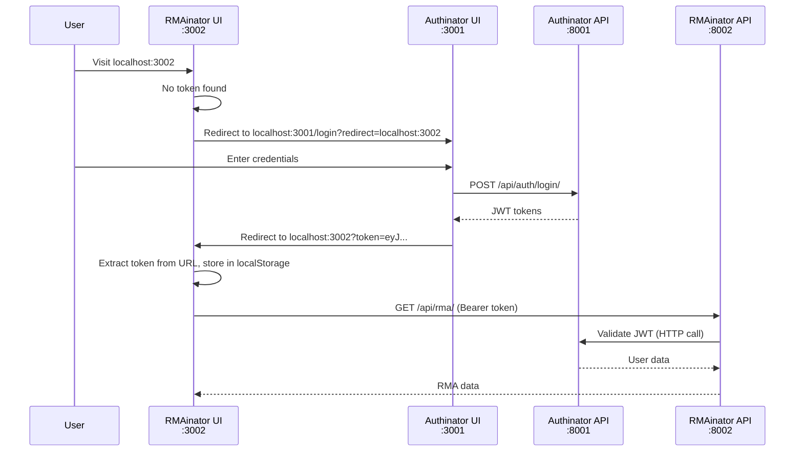
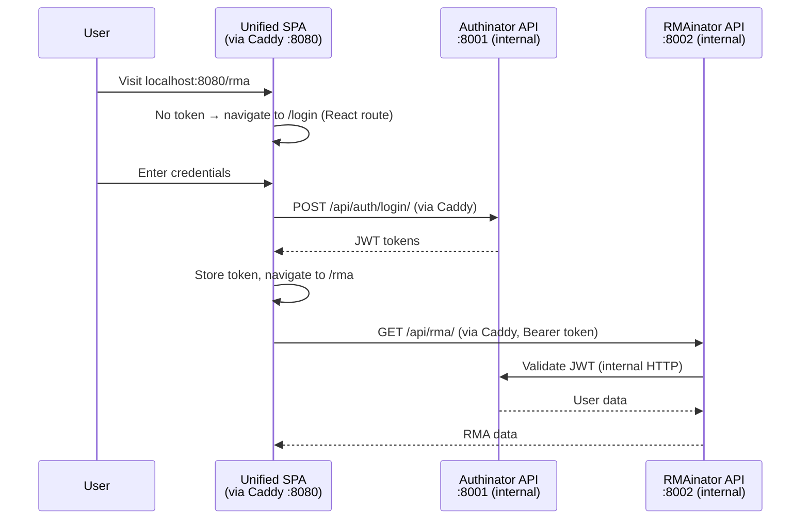
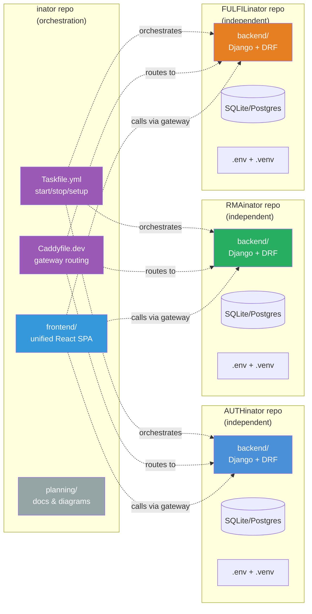

# Gateway Architecture: Before & After

## Current Architecture (Before)

Six ports exposed. Each inator runs its own frontend and backend independently.
The browser talks directly to each service. Cross-origin auth tokens are passed
via URL query parameters.

### Problems

- **6 ports** exposed (8001, 8002, 8003, 3001, 3002, 3003)
- **CORS required** — every backend lists every frontend origin
- **Cross-origin auth** — token passed via `?token=` URL param on redirect
- **Duplicate code** — 3 separate React apps with near-identical Layout, auth utils, API clients
- **Each new inator** adds 2 more ports, CORS entries, and a separate frontend app

---

## Target Architecture (After)

Two internal-only ports per backend (unchanged). One gateway port exposed.
A single frontend SPA handles all UI. Caddy routes API requests by path prefix.

### Benefits

- **1 port exposed** (8080 in dev, 443 in prod)
- **Zero CORS** — everything is same-origin through the gateway
- **In-app auth** — login is a React route, no cross-origin redirects
- **One frontend** — shared Layout, auth context, API client
- **New inator** = 1 Caddy route line + 1 frontend module directory

---

## Detailed Communication Flow

### Auth Flow (Before vs After)

**Before** — Multi-hop cross-origin redirect:

**After** — Single-origin, no redirects:

---

## Repository & Deployment Boundaries

Each repo remains fully independent. The inator repo orchestrates, but never
contains backend application code.

### What Changes Per Repo

| Repo | Gains | Loses | Unchanged |
|------|-------|-------|-----------|
| **inator** | `frontend/`, `Caddyfile.dev`, gateway tasks | — | Taskfile orchestration, README, planning docs |
| **AUTHinator** | Simplified CORS config | Frontend traffic (UI moves to unified SPA) | Backend API, DB, auth logic, SSO, MFA |
| **RMAinator** | Simplified CORS config | Frontend traffic | Backend API, DB, RMA state machine, JWT validation |
| **FULFILinator** | Simplified CORS config | Frontend traffic | Backend API, DB, PO/Order/Delivery logic, JWT validation |

Each inator's `frontend/` directory can be kept for reference or archived.
Backend `Taskfile.yml` tasks (`backend:dev`, `backend:test`, etc.) remain unchanged.
